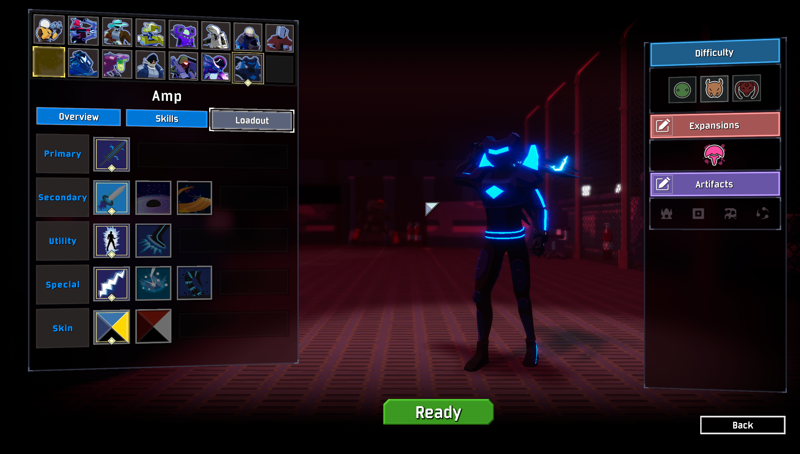
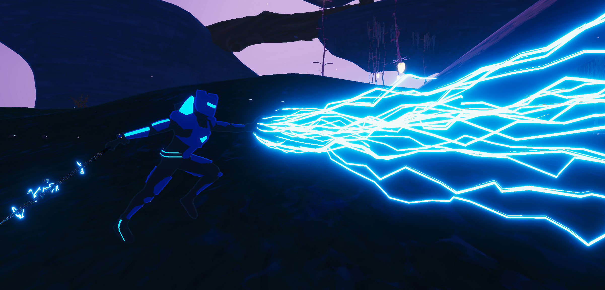
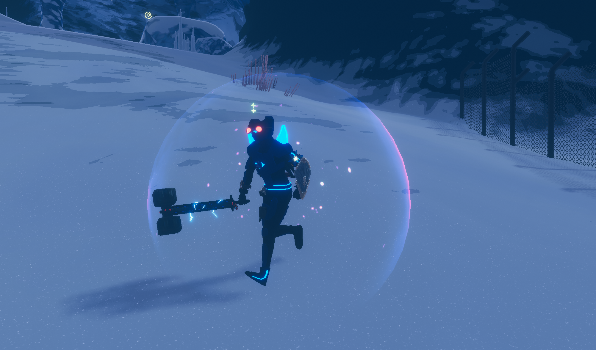
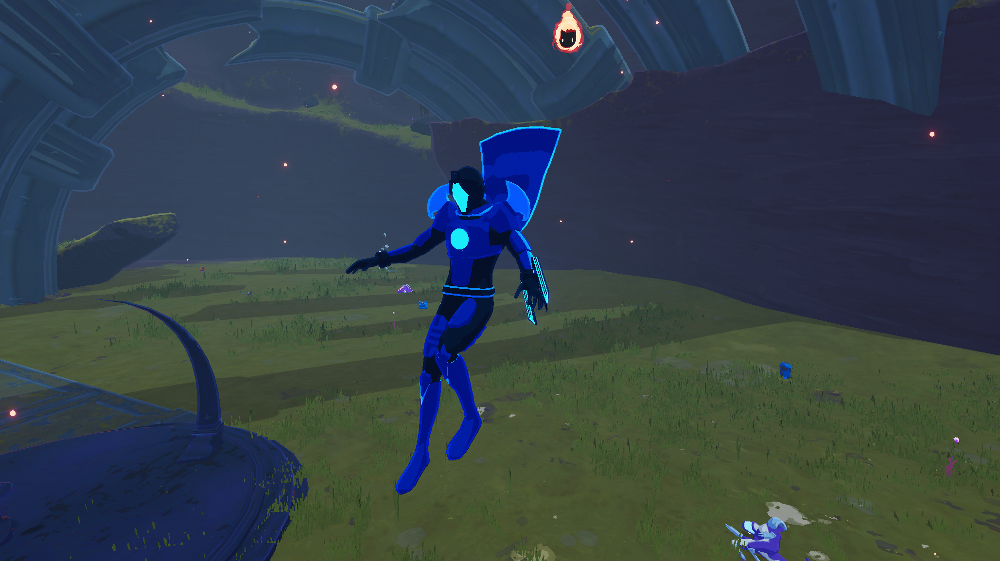

# Overview
- Adds in two new characters: Amp, an agile melee/ranged survivor, and Nemsis Amp, a burst damage ranged survivor, both of whom fight with the electrifying power of electromagnetism.
- Featuring a combined total of 15 custom skills, two unique passives, lore, mastery skins, item displays, unique Mithrix dialogue, and more!
- **DISCLAIMER**: Amp (and to some extent Nemesis Amp) is still a WIP survivor, so many things are subject to change, and you may encounter some bugs (in the case of multiplayer, "may" turns into "will").

For feedback & bug reporting, message Neon#2032 on discord or just @ me in the modding server  (https://discord.gg/VuRshdPgvU). I really appreciate any and all feedback; I want Amp to be as fun to play as possible!

NOTE: IF YOU HAVE AN ERROR THAT MENTIONS UNLOCKABLEAPI, AND CAUSES AMP TO NOT APPEAR IN THE LOBBY, UPDATE BEPINEXPACK.

# Gameplay Pictures

  
   
  

  
   
   

# To Do
- Fix multiplayer functionality
- Adjust some animations 
- For a more detailed WIP list as well as a list of known bugs, visit the github!

# Credits
- Neon: Animations, Code, VFX, SFX
- Gaborade: Modeling
- Spanish: Updated Amp Animations
- NotWhoYouThink: Lorentz Cannon Code & VFX, Charge Orb Networking
- Vale-X (Manipulator): Charge debuff icon
- RandomlyAwesome: Helping me out with networking code
- Tyler Cook: Nemesis Amp Meter Design Feedback
- Mr. Bones: Reformation skin
- Bubbet: Fixing Melvin's health in multiplayer
- Goodguy: Nemesis Amp Skill Icons
- SpanishSpace: New Amp Animations 
- The Risk of Rain 2 Modding Server: Helping me stay sane through all kinds of other bugs I wouldn't have been able to solve on my own.

# Change Log

2.0.3

 - General
    - Fixed the photo displays
    - I swear I'm still working on this 

2.0.2

 
 - Nemesis Amp
    - New known bugs
        - Body sometimes doesn't disappear after death in multiplayer
     - Fulmination
        - Fixed an error that sometimes appeared in multiplayer where the chaining functionality of this skill would misbehave
    - Voltaic Onslaught
        - Range indicator now disappears and reappears depending on if the skill has been replaced or not (e.g. essence of heresy)
    - Voidsurge
        - Added VFX for when the plasma projectile is available
    - Config
        - Added an option to auto unlock the mastery skin
        - Removed redundant option to unlock Nemesis Amp
    - Added lore log entry

2.0.1

 
 - Nemesis Amp
    - Achievements
        - Fixed a bug that allowed players to acquire the "299,792,458 m/s" achievement in the bazaar between time
    - Growing Surge
        - Updated skill description to accurately display the amount of seconds one has to acquire extra stacks
    - Fulmination
        - Tentatively increased fulmination range
        - Fixed a bug that allowed players to spam this ability with fast clicking
    - Furious Spark
        - Increased beam radius; may be further increased in future updates.
    - Voidsurge
        - Increased the speed of the plasma projectile
    - Voltaic Onslaught
        - Adjusted visibility of default skin range indicator; can turn this off in the configs if you find it distracting

2.0.0

 
 - The biggest update since launch! Featuring new animations, and a whole new character for you to play around with!
-  New Character  
    - Nemesis Amp has been added to the mod! An entirely new version of Amp, tainted by the void, with his own unique skills and passive. Feedback on him would be appreciated as well.
- Animations
    - Adjusted some of normal Amp's animations, including his jump. Further updates will implement a full animation overhaul that will allow you to switch between old animations and new ones!
- General
    - Adjusted sound attenuation for some of normal Amp's abilities
- More features and bug fixes to come! 

 
1.2.1

- Magnetic Vortex
    -  Fixed a bug where the muzzle effect wouldn't disappear on firing

1.2.0

- Sorry it's been so long! School was really messing me up, and I only recently was able to get some real changes made. This mod definitely isn't abandoned, so don't worry; more updates to come!
- New Known Bugs
    - Amp will sometimes randomly become invincible in multiplayer; I actually think I fixed this issue, but since the occurrence is near random and there's no error in the log when it occurs it's hard to test. So, if you run into this problem, please let me know!
    - Amp will sometimes randomly switch skins mid-run
    - This has not yet become an issue, but if you're playing multiplayer while not being the host and you find that achievements aren't working, let me know!
    - If someone is using the red sprite skin in multiplayer, then every Amp will have their surge skill use the red VFX, even if they have the normal skin.
- General
    - Cleaned up the config file and removed unused entries
    - Fixed a glitch that caused a "bad statetype null" error upon cancelling Fulmination early
    - Grammar and wording adjustments for select screen tips & lore
    - Moved unlockables to use vanilla methods instead of R2API's UnlockableAPI; this has the unintended side effect of re-locking Amp's Red Sprite Skin if you've already unlocked it, but as said before you can always just head to the config file to re-unlock it.
        - Note: all new unlockables can be unlocked in config settings as well, if you're not up to the challenge
- Animations
    - Fixed Amp's ascending animation not looping
    - Fixed Amp's movement animations not showing up for clients
- Skins
    - Amp's "Reformation" Skin is now unlocked by beating the game on Typhoon or any higher difficulty
- Charge
    - Now creates floating electric orbs above an enemy's head that indicate how many stacks of charge they have. If they're too distracting, you can disable these in the config. 
    - No special VFX for electrified yet unfortunately; I would've put them in this patch, but didn't have enough time and I wanted to get this one out ASAP.
- Plasma Slash
    - Is now an unlockable
- Surge
    - Fixed a glitch where clients on a multiplayer server wouldn't be able to properly use this ability. It's still kind of laggy, but that'll be fixed in the next patch, which will hopefully complete Amp's multiplayer compatibility.
    - Fixed a glitch where the Surge exit explosion wouldn't appear in mutliplayer.
- Magnetic Vortex
    - Fixed a glitch where bright flashing purple "walls" would appear around the map upon usage (for real this time I think; if you still encounter this, please let me know!)
    - Fixed a glitch where the sound for the end explosion wouldn't play.
- Bulwark of Storms
    - Is now an unlockable

 
1.1.1

 
- General
    - Removed a glitch where Pulse Leap would play an additional sound it wasn't supposed to

 
1.1.0

 
- General
    - Amp's Mastery skin, Red Sprite, now has red lightning effects!
        - Also added a config so you can choose whether to have red lightning or the original blue
        - Let me know if the red Voltaic Bombardment effects are too intense; I'm a bit on the fence on whether or not they're fine as is, or if they need to be toned down a bit. Let me know how you feel about the other red vfx changes too!
    - I know I said this patch would include some extra VFX for charged & a magnetic vortex special effect, but I wanted to get this out first since school's taking up a lot of my time now & it may be a while before I get to that. Next patch for sure though, promise!
        - I'm also going to try to fix Surge not working properly in multiplayer next patch. Look forward to it!
- Plasma Slash
    - Amp now faces the direction of the cursor while using the ability
- Surge
    - Fixed effect glitching out upon running into enemies or the ground

 
1.0.10

 
- 1.0.10
    - Removed wormhealth item from chests

 
1.0.9

- General
    - SOUNDS! No more being deafened by a magnetic vortex halfway across the map, as sounds should all now have attentuation and not be as earrapey. If you still have issues with sounds being way too loud or sounds being heard from everywhere on the map, please let me know!!
        - Also added pitch randomization to a few sounds, should make them not as dull to hear over and over again.
    - Added new skin, "Reformation". Credit to Mr. Bones!
    - Next patch to address some more multiplayer bugs & add some extra VFX for charged & electrified, as well as a special charged effect for Magnetic Vortex.
- Charge
    - Explosion no longer applies shocked status effect
    - Explosion now applies a debuff called "electrified", which acts as a lingering charge debuff that allows Amp to continue to apply his secondary abilities' special effects.
- Modified Shockblade
    - Further increased range, now much more in line with vanilla melee survivors
    - Reduced damage from 160% to 150%
- Lorentz Cannon
    - Increased damage from 130% to 140%
    - Added projectile trails to improve visibility
- Magnetic Vortex
    - Increased projectile speed from 70 to 90
    - Increased projectile radius from 0.6 to 1.0
    - SHOULD HAVE fixed a bug where the VFX messed up and caused flashing purple walls to appear everywhere. Please let me know if you still encounter it!
    - Plasma Slash
    - Further increased grounded slash range
- Surge
    - Cancelling early now completely stops your momentum. Use this to precisely maneuver around attacks!
        - This functionality doesn't appear in multiplayer; to be fixed with next patch!
    - Adjusted hitbox position
- Pulse Leap
    - Sped up exit flip animation
    - Decreased explosion effect size
- Bulwark of Storms
    - Fixed Melvin's name/health not showing up correctly in multiplayer
        -Sidenote: if you find an item named WORMHEALTH please let me know.

 
1.0.8

 

- Reworked item displays to be compatible with extra item mods; mod loading shouldn't get stuck at 100% anymore

 
1.0.7

- Discovered incompatability with Extra Fireworks & updated README

 
1.0.6

- General
    - Fixed bug where UnlockableAPI wouldn't load properly
    - Some more bug related and QOL changes to come soon, like making Lorentz Cannon's projectiles more visible & fixing a common bug where Amp's item displays cause loading to get stuck at 100% with certain mod combinations
- Modified Shockblade
    - Extended depth range from 7 to 10.5 units
    - Extended horizontal range from 6.6 to 7.5 units
    - Extended vertical range from 5 to 6 units
    - Buffed damage from 140% to 160%
    - Slashes now *guarantee* a proc of charge instead of having a 20% chance. This is a tentative change to make melee a more viable option.
- Plasma Slash
    - Fixed a bug where plasma slash could interrupt itself when multiple charges were present
    - Extended slash dimensional ranges: 
        - Depth: from 15 to 16.5 units
        - Horizontal: from 15 to 17 units
        - Vertical: from 6 to 9 units
    - Increased width of projectile, should be easier to hit now
- Lorentz Cannon
    - Increased strength of homing; should be much more consistent now
    - Increased cooldown from 1.5 to 3 seconds
    - Reduced bullet damage from 160% to 130%
    - Reduced proc coefficient per bullet from 1 to .7
- Magnetic Vortex
    - Fixed a bug where killing/damaging enemies wouldn't cause item procs
    - Radial damage & explosion now consistently apply in multiplayer
- Surge
    - Increased contact damage from 100% to 150%; again, a really tentative change
    - Increased cooldown from 8 to 10 seconds
- Pulse Leap
    - Fall damage removal now works in multiplayer
    - Fixed NRE spamming the console in multiplayer
- Fulmination
    - Reduced damage from 2400% to 2200%
- Voltaic Bombardment
    - Increased damage from 1000% to 1400%
    - Increased overcharge duration from 3 to 5 seconds

 
1.0.0 -> 1.0.5

- READMEs are hard

